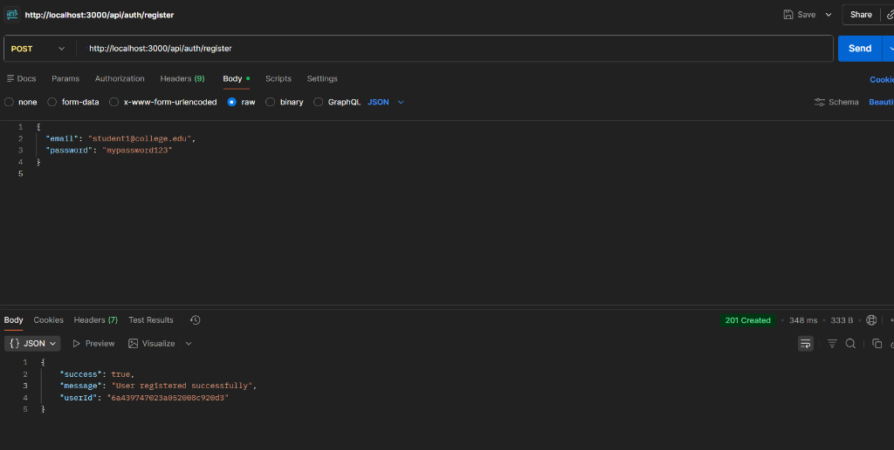
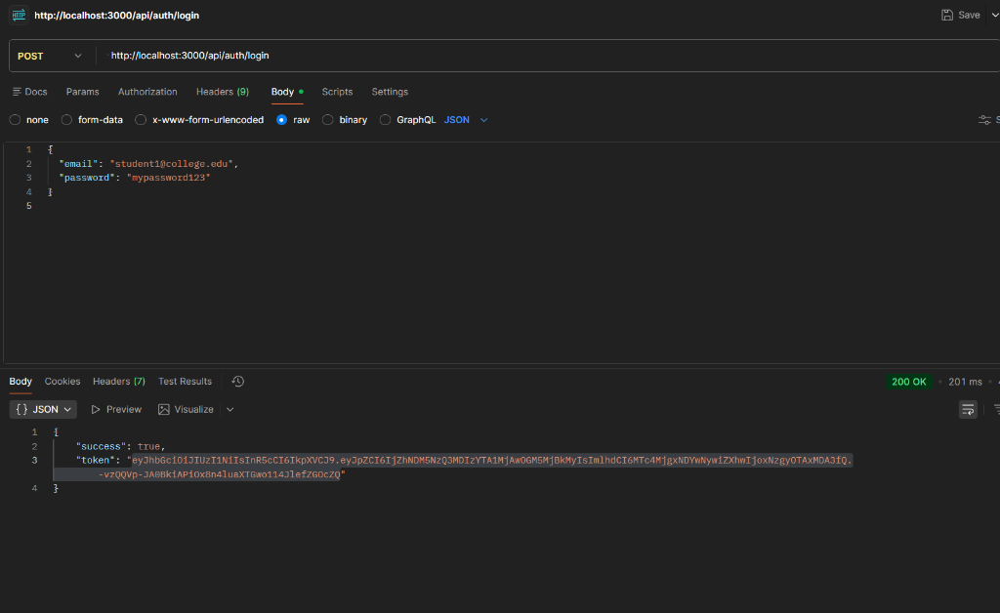
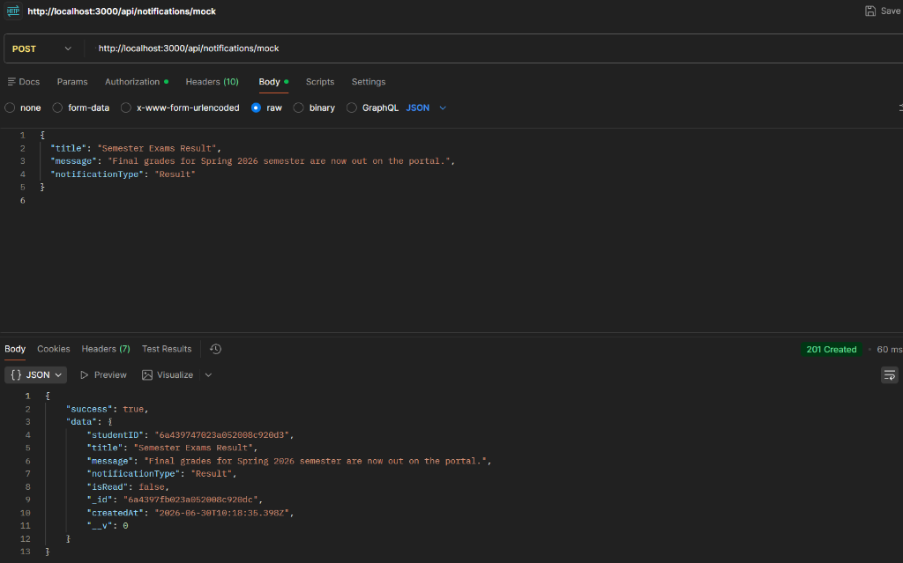
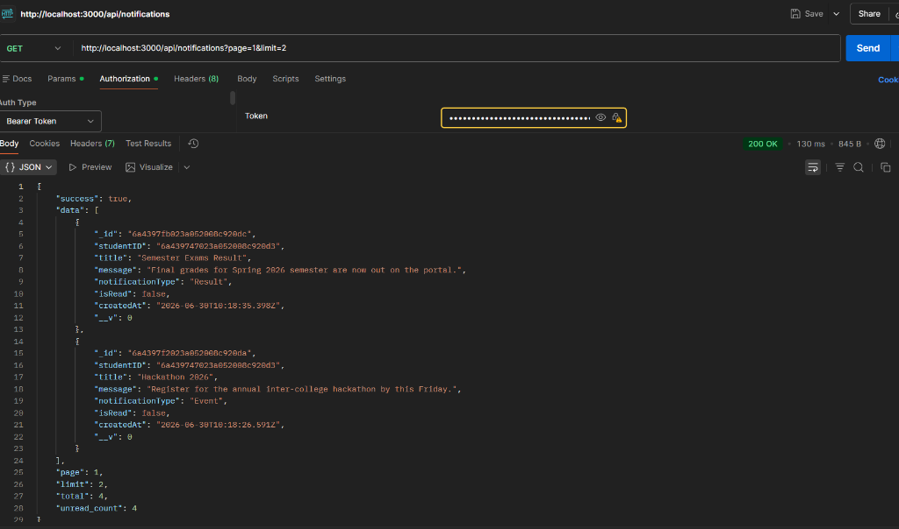
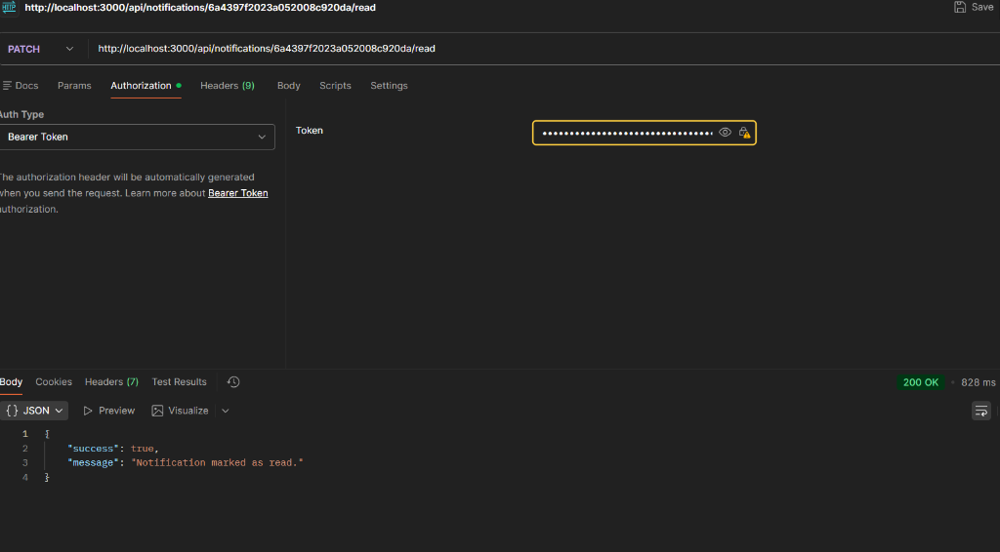
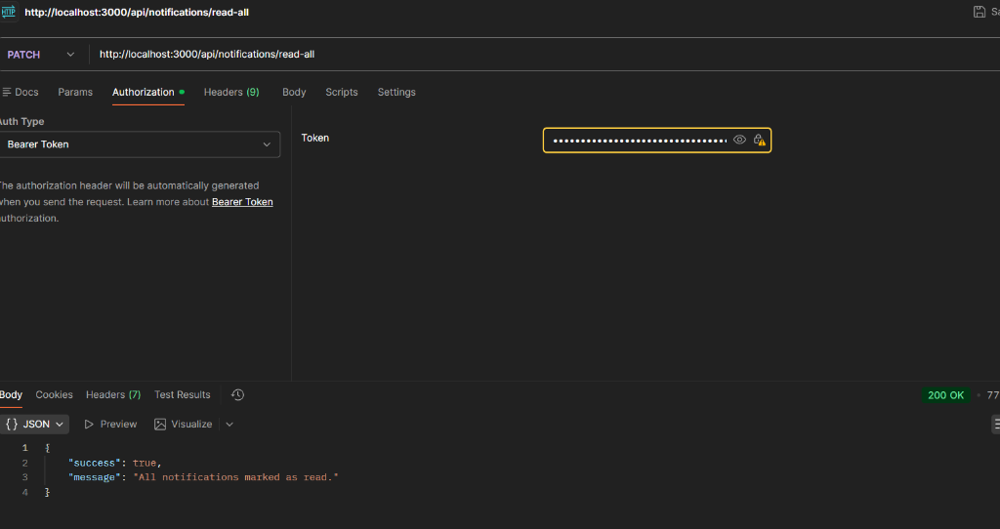

# Notification Service API

## API Testing Screenshots (Postman)

### 1. Register User (`POST /api/auth/register`)

### 2. Login User (`POST /api/auth/login`)

### 3. Create Mock Notification (`POST /api/notifications/mock`)

### 4. Paginated Notifications (`GET /api/notifications`)

### 5. Find Placement Students in Last 7 Days (`GET /api/notifications/placement-students`)

### 6. Read a Notification (`PATCH /api/notifications/:id/read`)

### 7. Read All Notifications (`PATCH /api/notifications/read-all`)

